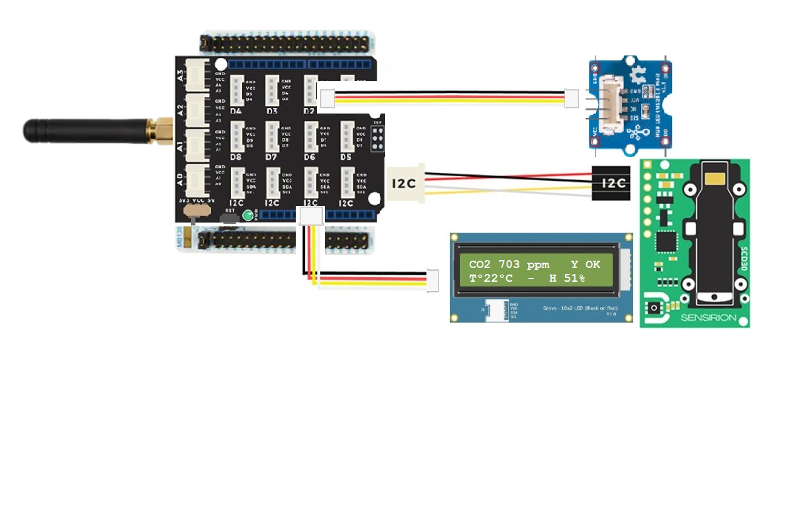

# ObjectifAir LoraWan
## Presentation
Ce projet a pour but de faire une carte autonome de mesure de qualtité de l'air (CO2+temperture+humidité) dans une piece et d'alerter quand le seuil devient trop critique. 
Ce projet est derivé du projet STM32Cube_FW_WL_V1.1.0\Projects\NUCLEO-WL55JC\Applications\LoRaWAN\LoRaWAN_End_Node de STMicroelectronics.
Pour fonctionner correctement, il vous faudra les composants suivant :

- 1 carte nucleo STM32WL55JC1 (High Band 868MHz)
- 1 Seeed Grove Shield V2 for Arduino
- 1 Led RGB Neopixel Grove (D2 connector)
- 1 afficheur LCD I2C Grove (16x2)
- 1 capteur de I2C CO2 Sensirion SCD30

## Cablage des composants

## Flashage du firmware
Vous aurez besoin d'un câble USB vers micro-USB. Une fois connecté à l'aorinateur, un lecteur de masse nommé NOD_WL55 devrait apparaitre.
Il ne reste plus qu'a deplacer l'executable ObjectAir.hex dans ce drive pour flasher le firmware sur la carte .
Le firmware demarre et affiche le DevEUI sur l'ecran LCD.
Ensuite la mesure du CO2 (en ppm), la temperature, l'humidité et l'etat du reseau Lora (Ok/Ko) s'afficheront aussi.

## Traces console RS232
@115200 baud, 8bit, no parity, en se connectant au VirtualComPort (VCP) (installation du driver STSW-STM32102) les traces suivantes s'affichent :  
APP_VERSION:        V1.1.0  
MW_LORAWAN_VERSION: V2.3.0  
MW_RADIO_VERSION:   V1.1.0  
\###### OTAA ######  
\###### AppKey:      2B:7E:15:16:28:AE:D2:A6:AB:F7:15:88:09:CF:4F:3C  
\###### NwkKey:      2B:7E:15:16:28:AE:D2:A6:AB:F7:15:88:09:CF:4F:3C  
\###### ABP  ######  
\###### AppSKey:     2B:7E:15:16:28:AE:D2:A6:AB:F7:15:88:09:CF:4F:3C  
\###### NwkSKey:     2B:7E:15:16:28:AE:D2:A6:AB:F7:15:88:09:CF:4F:3C  
\###### DevEui:  00:80:E1:15:??:??:??:??  
\###### AppEui:  01:01:01:01:01:01:01:01  
\###### DevAddr: ??:??:??:??  
1s609:TX on freq 868300000 Hz at DR 0  
3s095:MAC txDone  
8s128:RX_1 on freq 868300000 Hz at DR 0  
8s327:IRQ_RX_TX_TIMEOUT  
8s327:MAC rxTimeOut  
9s128:RX_2 on freq 869525000 Hz at DR 0  
10s934:MAC rxDone  
\###### = JOINED = OTAA =====================   
\###### ========== MCPS-Indication ==========  
31s641:temp= 22  
31s641:humidity= 50  
31s641:co2= 1427  
31s641:@Graph:CO2:1427|T:22|Hum:50|  
41s653:temp= 22  
41s653:humidity= 50  
41s653:co2= 1427  
etc...
